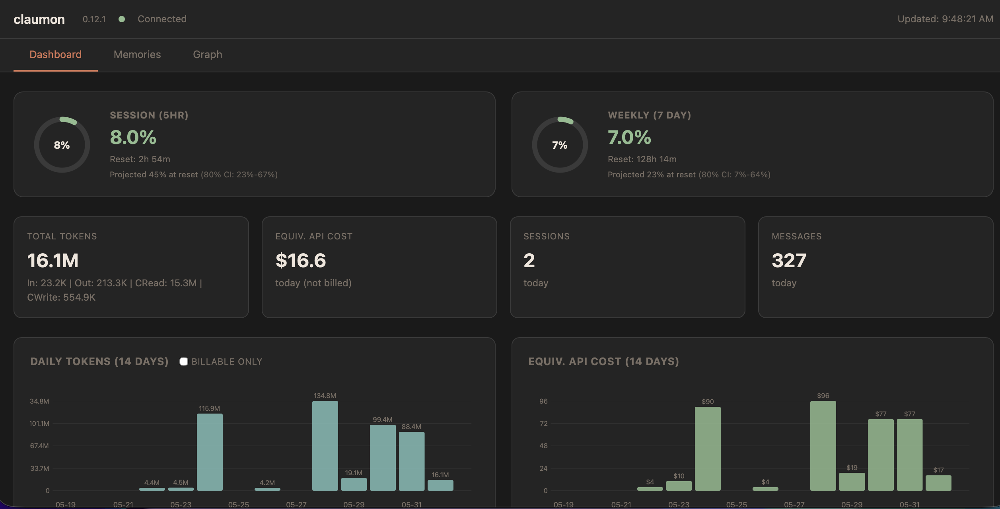
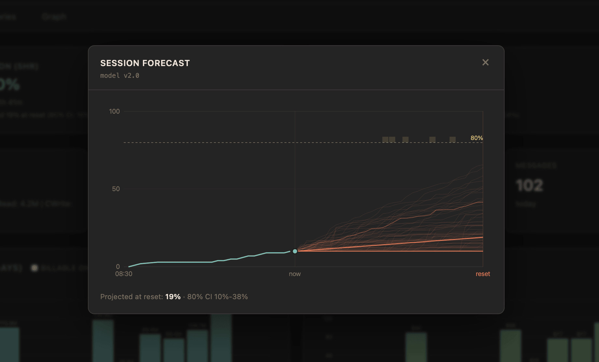
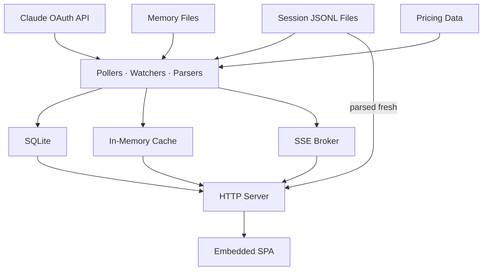

[](https://goreportcard.com/report/github.com/fabioconcina/claumon)
[](https://github.com/fabioconcina/claumon/releases/latest)
[](go.mod)
[](LICENSE)
[](https://github.com/fabioconcina/claumon/releases/latest)

# claumon

**See where your Claude Code limits are headed before you hit them.**

Single binary, zero config, one browser tab. Runs on macOS, Linux, and Windows.

## Why claumon?

Anthropic's usage analytics dashboard is for Team and Enterprise org admins; it is [not available to individual Pro or Max plans](https://support.claude.com/en/articles/12157520). What individuals get (`/usage`, the claude.ai usage page) shows where you stand right now - but no history, no per-session costs, and no idea where you're heading before the limit hits. claumon is that missing dashboard, running locally on your machine.

What sets it apart:

- **Live rate-limit gauges.** Session, weekly, and per-model utilization straight from the Claude OAuth usage API - measured, not estimated from logs.
- **Forecasts you can check.** Projected utilization at reset with an 80% credible interval and ETA-to-threshold, from an empirical-Bayes model refit daily on your own usage history. The model is published ([MODEL.pdf](internal/forecast/MODEL.pdf)) and benchmarked out-of-sample with proper scoring rules - not a burn-rate extrapolation or a percentile heuristic.
- **Your whole `~/.claude` footprint in one place.** Per-session token and cost breakdowns, historical trends in SQLite, running-process control, and a memory-file browser with health scores and a relationship graph.

Everything updates in real time via SSE, and daily aggregates persist in SQLite so you can track usage over weeks, not just the current session. No Node, no Python, no build step, no config. Run it and open a browser tab.

## How it compares

Honest snapshot (June 2026), based on each project's documentation:

| | claumon | [ccusage](https://github.com/ryoppippi/ccusage) | [Claude-Code-Usage-Monitor](https://github.com/Maciek-roboblog/Claude-Code-Usage-Monitor) | [claude-usage](https://github.com/phuryn/claude-usage) |
|---|---|---|---|---|
| Interface | Local web UI | CLI reports | Terminal TUI | Local web UI |
| Runtime | Single Go binary | Node (npx) | Python (pip/uv) | Python |
| Rate limits | Live from OAuth usage API | Derived from local logs | Estimated from local logs | - |
| Forecasting | Calibrated credible intervals, benchmarked ([spec](internal/forecast/MODEL.pdf)) | Burn-rate projection (live mode) | P90 percentile heuristic | - |
| Cost & history | SQLite, daily aggregates, trends | JSONL reports | Session window | SQLite, charts |
| Memory-file browser & graph | Yes | - | - | - |

If you want quick CLI cost reports, ccusage is excellent and more battle-tested. claumon is for keeping a live dashboard open: where your limits stand, where they'll land, and what's in your `~/.claude`.

<p align="center">
  <br>
  <sub>Live dashboard: rate-limit gauges, token and cost breakdowns, and 14-day trends.</sub>
</p>

<p align="center">
  <br>
  <sub>Session forecast: projected usage at reset with an 80% confidence interval.</sub>
</p>

## Quick start

**Homebrew (macOS / Linux):**

```bash
brew install fabioconcina/claumon/claumon
claumon
```

**Download a prebuilt binary** from [the latest release](https://github.com/fabioconcina/claumon/releases/latest):

```bash
# macOS (Apple Silicon)
curl -Lo claumon https://github.com/fabioconcina/claumon/releases/latest/download/claumon-darwin-arm64
chmod +x claumon
# If blocked by Gatekeeper: right-click -> Open, or run: xattr -d com.apple.quarantine claumon
./claumon

# macOS (Intel)
curl -Lo claumon https://github.com/fabioconcina/claumon/releases/latest/download/claumon-darwin-amd64
chmod +x claumon
# If blocked by Gatekeeper: right-click -> Open, or run: xattr -d com.apple.quarantine claumon
./claumon

# Linux (x86_64)
curl -Lo claumon https://github.com/fabioconcina/claumon/releases/latest/download/claumon-linux-amd64
chmod +x claumon
./claumon

# Windows (x86_64)
# Download claumon-windows-amd64.exe from the releases page
# If blocked by Defender: right-click the .exe -> Properties -> Unblock
# Or run: Unblock-File claumon-windows-amd64.exe
```

**Build from source:**

```bash
go install github.com/fabioconcina/claumon@latest
claumon
```

Open [http://localhost:3131](http://localhost:3131) in your browser.

claumon reads credentials from `~/.claude/.credentials.json` (created by `claude /login`), or falls back to the OS credential store (macOS Keychain, Windows Credential Manager) used by the VS Code extension. If credentials are missing, session tracking still works. Only the API usage gauges are unavailable.

### Command-line flags

| Flag | Description |
|------|-------------|
| `--open` | Open the dashboard in your browser on startup |
| `--port` | Override the dashboard port (default from config) |
| `--db` | Override the DB path (e.g. a copy, to run a test instance) |

## Run as a background service

Run claumon automatically on login so the dashboard is always available. First, move the binary to a permanent location, then register the service.

**macOS:**

```bash
mkdir -p ~/.local/bin
mv claumon ~/.local/bin/
# Add to PATH if not already: export PATH="$HOME/.local/bin:$PATH"
claumon service install
```

Creates a LaunchAgent at `~/Library/LaunchAgents/com.claumon.dashboard.plist`. Logs go to `~/.claumon/claumon.log`.

**Linux:**

```bash
mv claumon ~/.local/bin/
claumon service install
```

Creates a systemd user unit at `~/.config/systemd/user/claumon.service`. Logs go to journald (`journalctl --user -u claumon`). By default, systemd user services stop when you log out. To keep claumon running after logout, enable lingering: `loginctl enable-linger $USER`.

**Windows (PowerShell):**

```powershell
# Move the exe to a permanent location
New-Item -ItemType Directory -Force "$env:LOCALAPPDATA\Programs\claumon"
Move-Item claumon-windows-amd64.exe "$env:LOCALAPPDATA\Programs\claumon\claumon.exe"

# Add to PATH (current user, persists across sessions)
$p = [Environment]::GetEnvironmentVariable('Path', 'User')
[Environment]::SetEnvironmentVariable('Path', "$p;$env:LOCALAPPDATA\Programs\claumon", 'User')

# Restart your terminal, then:
claumon service install
```

Adds claumon to the Windows Startup folder - it launches automatically (hidden) on login.

**Manage the service:**

```bash
claumon service status     # check if running
claumon service restart    # restart after config changes
claumon service uninstall  # stop and remove
```

No root or admin required on any platform.

## VS Code extension

A companion VS Code extension puts your live usage in the editor status bar and
embeds the dashboard in a panel, so you do not need a browser tab open. The
status bar shows the current percentage and, when a forecast is available, the
projected percentage at reset (e.g. `45%->72% session`); the hover tooltip adds
the session/weekly breakdown, reset times, and the forecast detail.

It is a **client only** and connects to a claumon server you are already running
(default `localhost:3131`); it does not start or bundle claumon.

Install it with one command (grabs the latest `.vsix` from GitHub and installs
it via the `code` CLI):

```bash
curl -fsSL "$(curl -fsSL https://api.github.com/repos/fabioconcina/claumon/releases | grep -o 'https://github.com/[^"]*\.vsix' | head -1)" -o /tmp/claumon.vsix && code --install-extension /tmp/claumon.vsix
```

On Windows, or for the manual "Install from VSIX..." steps, see
[`extension/`](extension/), where source and build instructions also live.

## Self-update

```bash
claumon update
```

Checks GitHub releases for a newer version, downloads the right binary for your platform, and replaces the current one. If a background service is installed, it restarts automatically after the update.

## Uninstall

Remove the background service (if installed), delete the binary, and optionally remove local data (SQLite database, logs, config, pricing cache).

**macOS / Linux:**

```bash
claumon service uninstall
rm ~/.local/bin/claumon
rm -rf ~/.claumon
```

**Windows (PowerShell):**

```powershell
claumon service uninstall
Remove-Item (Get-Command claumon).Source
Remove-Item -Recurse "$env:USERPROFILE\.claumon"
```

## What it tracks

### Rate limits (live from the Claude API)

- **Session** (5-hour) and **weekly** (7-day) utilization with reset countdowns
- **Per-model** Opus/Sonnet weekly quotas and **extra-usage credits**, when applicable
- Gauges color-coded: green (<50%), yellow (50–80%), red (>80%)

### Forecasts

- **Projected utilization at reset** with an 80% credible interval and ETA-to-threshold for each window, so you see where you'll land before you get there
- An **empirical-Bayes model refit daily** on your own past windows, over a monotone usage process; full spec in [`MODEL.pdf`](internal/forecast/MODEL.pdf) and benchmarked out-of-sample via `claumon bench` (CRPS/pinball, coverage, bias)

### Tokens & cost

- Per-session input / output / cache token breakdowns with **estimated API-equivalent cost**
- **Daily aggregates** with 14-day trend charts and a 24-hour activity heatmap

### Sessions & processes

- Active-sessions table (project, model, tokens, cost, messages, last activity) with a today/recent toggle and a full per-message detail view, auto-discovered from `~/.claude/projects/`
- **Running-process detection** with a stop button (SIGINT, conversation preserved on disk)

### Memory tools

- Browser for all memory files (CLAUDE.md, rules, per-project memories) with search, category filters, and staleness indicators
- **Health scores** (A–F per file with improvement tips) and **staleness alerts** (broken MEMORY.md links, orphans, index mismatches)
- An **interactive relationship graph** with project filters and click-to-navigate; click any file to open it in your editor via `vscode://`

## Keyboard shortcuts

| Key | Action |
|-----|--------|
| `1` `2` `3` | Switch to Dashboard, Memories, Graph tab |
| `/` | Jump to memory search |
| `Esc` | Close session detail panel |

## Live updates

The dashboard uses Server-Sent Events (SSE) - no polling, no manual refresh. Changes appear instantly:

- **Usage gauges** update every 2 minutes (configurable) from the Claude API
- **Session table** updates when any `.jsonl` session file changes on disk
- **Memory browser** highlights changed files with a visual pulse
- **Graph and staleness** re-render when memory files change on disk

A status dot in the top bar shows connection state (green = connected, red = disconnected).

## Configuration

Optional. Create `~/.claumon/config.json`:

```json
{
  "port": 3131,
  "poll_interval_seconds": 120,
  "credentials_path": "~/.claude/.credentials.json",
  "claude_dir": "~/.claude",
  "db_path": "~/.claumon/usage.db",
  "stuck_threshold_minutes": 10
}
```

All fields are optional. Defaults are shown above; claumon works without a config file.

## Data storage

claumon stores usage snapshots and daily aggregates in a SQLite database at `~/.claumon/usage.db`. Historical data is backfilled automatically on first startup by scanning all existing session files.

The database uses WAL mode for concurrent reads during writes. No maintenance required.

## How it works

claumon combines three data sources:

1. **Claude API** (`/api/oauth/usage`) - polled periodically for rate limit utilization. Requires OAuth credentials from `claude /login`.
2. **Session files** (`~/.claude/projects/*/*.jsonl`) - watched via `fsnotify` for real-time token counting. Each JSONL file is parsed for message-level token usage.
3. **Memory files** (`~/.claude/projects/*/memory/*.md`, `CLAUDE.md`, rules) - discovered and parsed for frontmatter, rendered as HTML, analyzed for cross-references and staleness.

Everything is embedded in a single binary via `//go:embed` - no external files, no Node.js, no build step for the frontend.

### Architecture



## License

MIT
