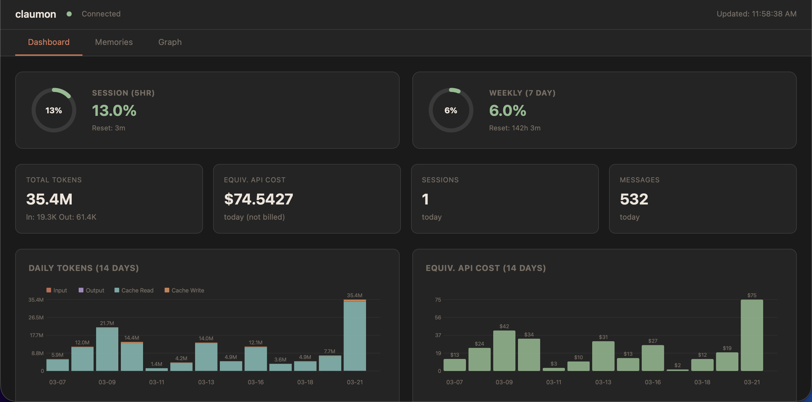
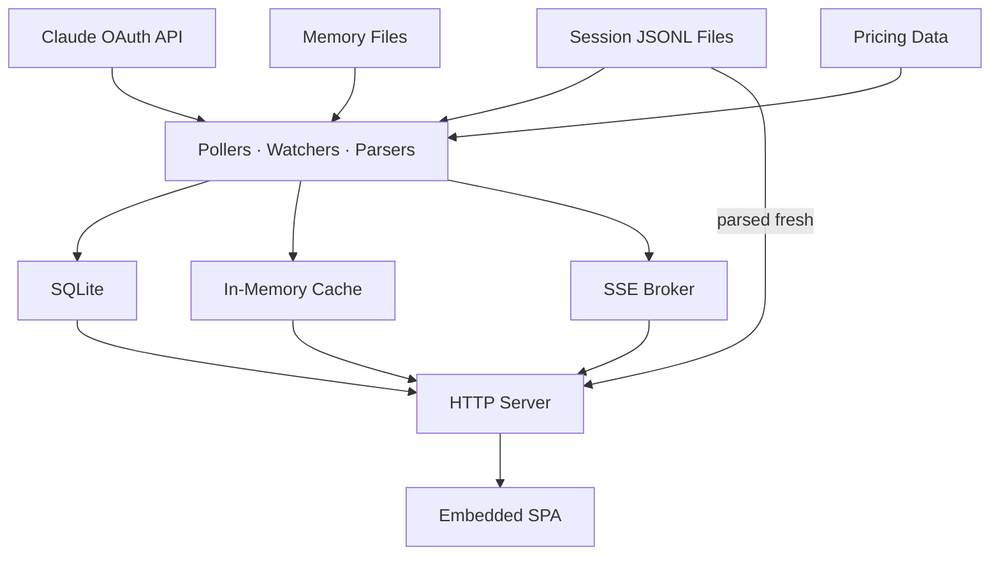

[](https://goreportcard.com/report/github.com/fabioconcina/claumon)
[](https://github.com/fabioconcina/claumon/releases/latest)
[](go.mod)
[](LICENSE)
[](https://github.com/fabioconcina/claumon/releases/latest)

# claumon

**Claude Code dashboard** — run it, see where your tokens go.

Single binary, zero config, one browser tab. Runs on macOS, Linux, and Windows.

## Why claumon?

There are plenty of Claude Code dashboards out there. This one isn't trying to be special — it's just my take on it, optimized for the things I care about: minimal, fast, and easy to set up.

Single binary, no dependencies, no build step, no config required. Run it and open a browser tab.

It gives you rate limit gauges, per-session token breakdowns, cost estimates, historical trends, conversation history, and a memory browser with relationship graph, health scores, and staleness alerts — all updating in real time via SSE. Daily aggregates are stored in SQLite so you can track usage over weeks, not just the current session.

<p align="center">
  
</p>

## Quick start

Download a prebuilt binary from [the latest release](https://github.com/fabioconcina/claumon/releases/latest):

```bash
# macOS (Apple Silicon)
curl -Lo claumon https://github.com/fabioconcina/claumon/releases/latest/download/claumon-darwin-arm64
chmod +x claumon
./claumon

# macOS (Intel)
curl -Lo claumon https://github.com/fabioconcina/claumon/releases/latest/download/claumon-darwin-amd64
chmod +x claumon
./claumon

# Linux (x86_64)
curl -Lo claumon https://github.com/fabioconcina/claumon/releases/latest/download/claumon-linux-amd64
chmod +x claumon
./claumon

# Windows (x86_64)
# Download claumon-windows-amd64.exe from the releases page
# If blocked by Defender: right-click the .exe -> Properties -> Unblock
# Or run: Unblock-File claumon-windows-amd64.exe
```

Or build from source:

```bash
go install github.com/fabioconcina/claumon@latest
claumon
```

Open [http://localhost:3131](http://localhost:3131) in your browser.

claumon reads credentials from `~/.claude/.credentials.json` (created by `claude /login`), or falls back to the OS credential store (macOS Keychain, Windows Credential Manager) used by the VS Code extension. If credentials are missing, session tracking still works — only the API usage gauges are unavailable.

## What it tracks

### Rate limits (live from Claude API)

- **Session usage** — 5-hour sliding window utilization with reset countdown
- **Weekly usage** — 7-day window utilization with reset countdown
- **Per-model quotas** — separate Opus and Sonnet weekly limits (when applicable)
- **Extra usage credits** — monthly limit and spend (if enabled)

Gauges are color-coded: green (<50%), yellow (50–80%), red (>80%).

### Token usage (from session files)

- **Input / output / cache read / cache write** tokens per session
- **Estimated equivalent API cost** using current model pricing
- **Daily aggregates** with 14-day trend charts
- **Activity heatmap** — 24-hour breakdown of token activity by hour

### Sessions

- **Active sessions table** — project, model, tokens, cost, messages, last activity
- **Today / Recent toggle** — switch between today's sessions and the 50 most recent across all time
- **Running process detection** — shows which sessions are actively running with green "active" badge
- **Session detail view** — full message timeline with per-message token counts and tool usage
- **Automatic discovery** — watches `~/.claude/projects/` for new and updated sessions

### Running processes

- **Live process table** — shows all running Claude Code processes with PID, chat title, project, type, and uptime
- **Stop button** — send SIGINT to gracefully stop any running process (conversation is preserved on disk)
- **Auto-refresh** — updates via SSE and periodic polling

### Memory browser

- **All memory files** — CLAUDE.md, rules, auto-memory indexes, per-project memories
- **Search** across content, path, project name, and frontmatter
- **Filter by category** — CLAUDE.md, Rules, Index, Memory
- **Staleness indicators** — green (today), gray (<7d), yellow (7–30d), red (>30d)
- **Staleness alerts** — broken MEMORY.md links, orphaned files, index mismatches
- **VS Code integration** — click to open files in your editor via `vscode://` links

### Memory health scores

- **Per-file grading** — each memory file gets a letter grade (A–F) based on freshness, structure, specificity, and connectedness
- **Improvement suggestions** — actionable tips for low-scoring files (add frontmatter, link from MEMORY.md, etc.)

### Memory graph

- **Interactive visualization** — nodes are memory files, edges show relationships
- **Project filters** — focus on specific projects
- **Clickable legend** — toggle node types on/off
- **Click to navigate** — click a node to jump to its file in the memory browser

## Keyboard shortcuts

| Key | Action |
|-----|--------|
| `1` `2` `3` | Switch to Dashboard, Memories, Graph tab |
| `/` | Jump to memory search |
| `Esc` | Close session detail panel |

## Live updates

The dashboard uses Server-Sent Events (SSE) — no polling, no manual refresh. Changes appear instantly:

- **Usage gauges** update every 2 minutes (configurable) from the Claude API
- **Session table** updates when any `.jsonl` session file changes on disk
- **Memory browser** highlights changed files with a visual pulse
- **Graph and staleness** re-render when memory files change on disk

A status dot in the top bar shows connection state (green = connected, red = disconnected).

## Configuration

Optional. Create `~/.claumon/config.json`:

```json
{
  "port": 3131,
  "poll_interval_seconds": 120,
  "credentials_path": "~/.claude/.credentials.json",
  "claude_dir": "~/.claude",
  "db_path": "~/.claumon/usage.db",
  "stuck_threshold_minutes": 10
}
```

All fields are optional — defaults are shown above. claumon works without a config file.

## Data storage

claumon stores usage snapshots and daily aggregates in a SQLite database at `~/.claumon/usage.db`. Historical data is backfilled automatically on first startup by scanning all existing session files.

The database uses WAL mode for concurrent reads during writes. No maintenance required.

## How it works

claumon combines three data sources:

1. **Claude API** (`/api/oauth/usage`) — polled periodically for rate limit utilization. Requires OAuth credentials from `claude /login`.
2. **Session files** (`~/.claude/projects/*/*.jsonl`) — watched via `fsnotify` for real-time token counting. Each JSONL file is parsed for message-level token usage.
3. **Memory files** (`~/.claude/projects/*/memory/*.md`, `CLAUDE.md`, rules) — discovered and parsed for frontmatter, rendered as HTML, analyzed for cross-references and staleness.

Everything is embedded in a single binary via `//go:embed` — no external files, no Node.js, no build step for the frontend.

### Architecture



## License

MIT
